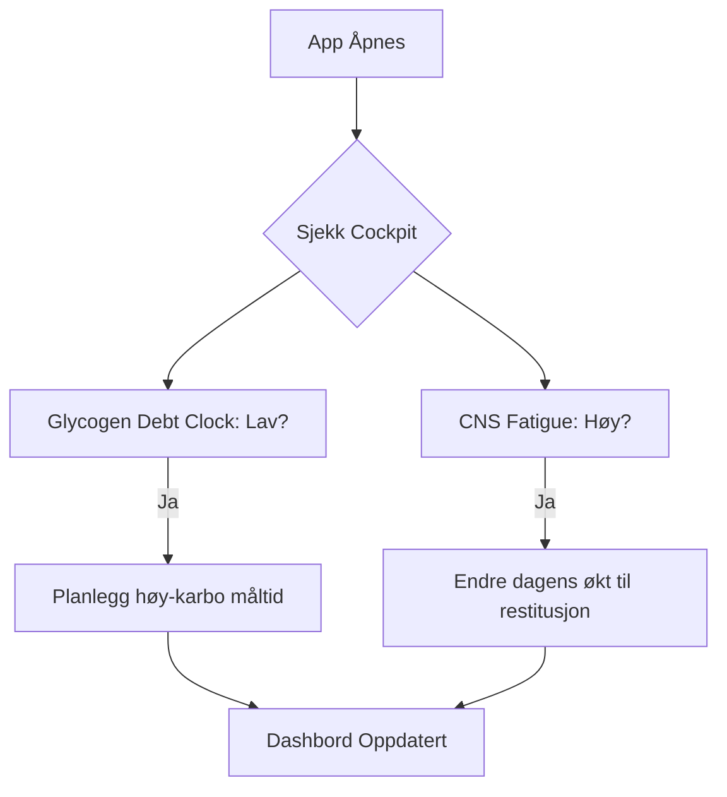
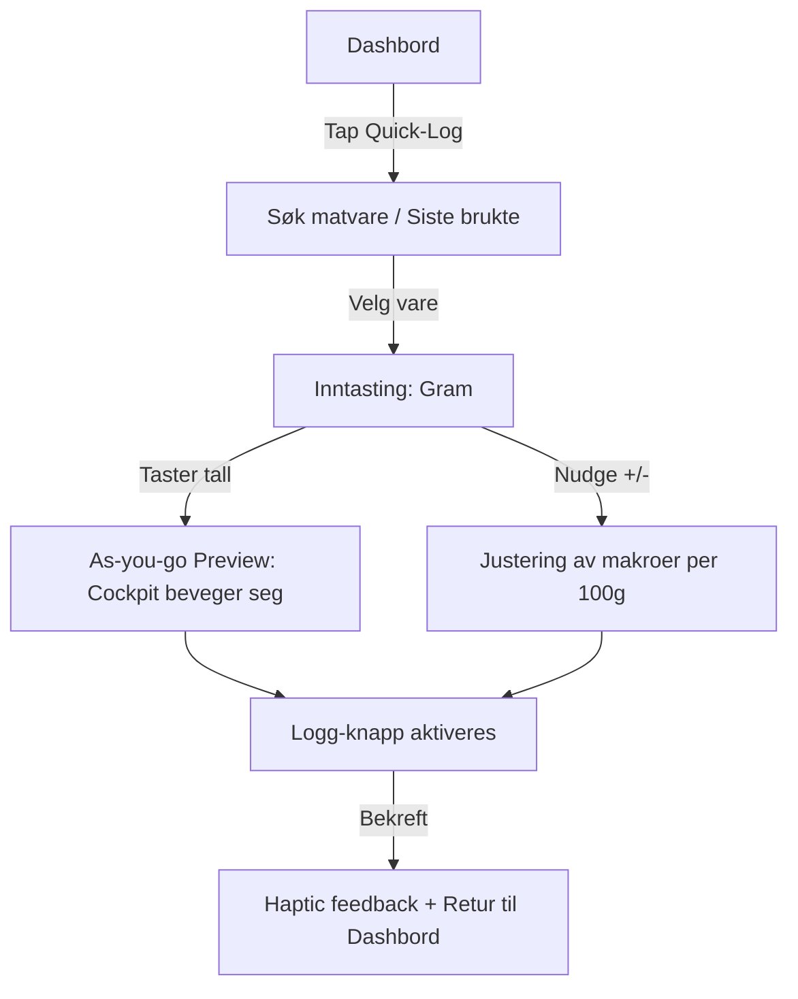
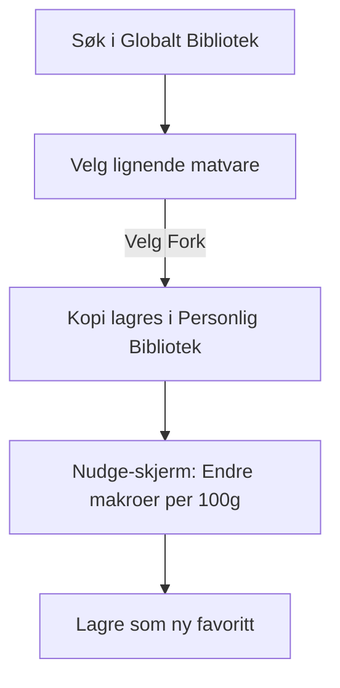

# UX Design Specification - Mat-Logger

**Author:** Robert
**Date:** fredag 15. mai 2026

---

## Executive Summary

### Project Vision
Mat-Logger skal transformere matlogging fra en administrativ byrde til en strategisk fordel. Ved å fungere som en "Body Cockpit", gir applikasjonen brukeren sanntids fysiologisk innsikt (CNS-tretthet og glykogenstatus) som direkte påvirker treningsbeslutninger. Målet er et grensesnitt som føles like presist som en vitenskapelig motor, men like intuitivt som et dashbord i en moderne bil.

### Target Users
Hovedbrukeren er en data-drevet treningsentusiast som prioriterer nøyaktighet over enkelhet. De er komfortable med vitenskapelige begreper, men setter pris på kontekstuelle forklaringer (tooltips/info-modaler) som knytter data til dagsform. Brukeren opererer i et multi-enhets miljø: rask inntasting på mobil i gymmet, og dypere analyse på desktop hjemme.

### Key Design Challenges
- **Minimere loggingsfriksjon:** Hovedutfordringen er å gjøre "Gram-Only" logging raskere enn konkurrentenes upresise metoder, spesielt gjennom "Fork & Nudge"-mønsteret.
- **Visualisering av komplekse data:** Å presentere CNS-tretthet og glykogenstatus på en måte som er umiddelbart forståelig og handlingsdrivende, uten å overvelde brukeren med tall.
- **Plattform-duallitet:** Sikre at dashbordet (Cockpit) fungerer like godt som et raskt mobil-blikk og som en detaljert desktop-analyse.

### Design Opportunities
- **Contextual Education:** Integrere utdanning om metabolisme direkte i grensesnittet for å bygge tillit til "Metabolic Motor".
- **Responsive Feedback:** Utnytte sanntidsoppdateringer (as-you-go) for å skape en følelse av direkte kontroll over kroppens indikatorer.

---

## Core User Experience

### Defining Experience
Kjerneinnsikten i Mat-Logger er "Metabolic Mirror"—følelsen av at applikasjonen er en direkte refleksjon av kroppens indre tilstand. Den mest frekvente og kritiske interaksjonen er matlogging, som må utføres med ekstrem hastighet uten å ofre nøyaktigheten til "Gram-Only"-modellen.

### Platform Strategy
- **Dual-Focus Web:** En responsiv Next.js-applikasjon.
- **Mobile (PWA):** Primærflate for inntasting i gymmet. Skal støtte strekkodelesing via mobilkamera og ha "thumb-friendly" kontroller.
- **Desktop:** Primærflate for analyse av trender og administrasjon av det personlige biblioteket.
- **Local-First:** Kritiske indikatorer (Glykogen/CNS) beregnes og vises lokalt umiddelbart, med asynkron synkronisering mot Supabase.

### Effortless Interactions
- **Fork & Nudge:** Opprettelse av nye matvarer skal skje ved å klone eksisterende data med ett klikk, etterfulgt av enkle verdi-justeringer.
- **As-you-go Updates:** Indikatorene i "Body Cockpit" flytter seg mens brukeren taster inn gram-vekt, noe som fjerner behovet for å "lagre og vente" på feedback.

### Critical Success Moments
- **The "Aha" Insight:** Det øyeblikket brukeren ser en lav glykogenmåler og forstår hvorfor de føler seg slappe før trening.
- **The Speed Win:** Når brukeren logger et fullt måltid i gymmet på under 10 sekunder med nøyaktige vekter.
- **The Trust Moment:** Når CNS-måleren stemmer overens med brukerens faktiske tretthetsfølelse etter en tung økt.

### Experience Principles
- **Precision with Speed:** Aldri la kravet om gram-presisjon føre til tregere inntasting enn konkurrentene.
- **Visual Evidence:** Vis fysiologisk endring umiddelbart for å forsterke sammenhengen mellom handling og resultat.
- **Resilient Utility:** Appen må fungere som et pålitelig verktøy selv i kjellere med dårlig mobildekning.

---

## Desired Emotional Response

### Primary Emotional Goals
- **Empowered Mastery:** Brukeren skal føle seg som en ekspert-operatør av sin egen fysiologi. Grensesnittet skal formidle en følelse av stålkontroll og optimalisering.
- **High-Velocity Accomplishment:** Matlogging skal føles som en serie små seire ("wins"), ikke en administrativ oppgave. Det skal gå så fort at det gir et "kick" av effektivitet.

### Emotional Journey Mapping
- **Morgen (Planlegging):** En følelse av analytisk oversikt og beredskap når "Cockpiten" sjekkes.
- **I Gymmet (Logging):** Total flyt. Brukeren er "i sonen" og appen er et verktøy som støtter, aldri forstyrrer.
- **Gjennom dagen (Tracking):** Trygghet på at man er i rute, spesielt med tanke på proteininntak.
- **Kveld (Oppsummering):** Vitenskapelig stolthet over å ha fulgt planen og gitt kroppen optimale forhold.

### Micro-Emotions
- **Tillit:** Bygget gjennom autoritativ, men moderne visualisering av data.
- **Spenning:** Energisk og moderne estetikk som motiverer til trening.
- **Løsningsfokus:** Unngå skyldfølelse; fokuser på hvordan man kan "nudge" seg tilbake på sporet.

### Design Implications
- **Protein-varsling:** For å unngå "Protein-angst", skal grensesnittet proaktivt (men ikke stressende) vise progresjon mot proteinmålet med tydelige fargekoder.
- **Energisk Estetikk:** Bruk av mørkt tema med høy-kontrast "action colors" for å skape en atletisk og moderne følelse.
- **Informasjonshierarki:** Skjul kompleksitet bak "tap-for-details" for å unngå at brukeren føler seg overveldet (Data Anxiety).

### Emotional Design Principles
- **Mastery over Mystery:** Forklar *hvorfor* en verdi endrer seg, slik at brukeren alltid forstår logikken bak tallene.
- **Actionable Accuracy:** Data skal aldri bare være informasjon; det skal alltid peke mot en handling (f.eks. "Spis 30g karbs nå").

---

## UX Pattern Analysis & Inspiration

### Inspiring Products Analysis
Mat-Logger henter inspirasjon fra tre nøkkelområder for å balansere presisjon og hastighet:
- **Wearables (Whoop/Oura):** For å lære hvordan komplekse fysiologiske data (strain/restitution) kan visualiseres med enkle, fargekodede instrumenter.
- **FinTech (Robinhood):** For "Action-first" hierarki, der den viktigste verdien (grafen) og den viktigste handlingen (Buy/Sell) er umiddelbart tilgjengelig.
- **Produktivitetsverktøy (Superhuman/Linear):** For følelsen av et "pro tool" with minimalt visuelt rot og fokus på ekstremt raske arbeidsflyter (snarveier og as-you-go).

### Transferable UX Patterns
- **Glanceable Indicators:** Bruk av sirkulære målere og ringsystemer fra wearables for Glycogen og CNS.
- **Central Action Hub:** En fremtredende "Quick Action Button" for logging, inspirert av FinTech.
- **Contextual Disclosure:** Skjule detaljert vitenskapelig informasjon bak interaktive elementer for å holde dashbordet rent, men autoritativt.

### Anti-Patterns to Avoid
- **Data Clutter:** Unngå MyFitnessPal-fellen med for mye irrelevant innhold (reklame/artikler) som står i veien for selve loggførigen.
- **Deep Menu Nesting:** Aldri tvinge brukeren gjennom mer enn to lag med navigasjon for å utføre en kjerneoppgave.
- **Success Lag:** Aldri vise en spinne-indikator etter inntasting av gram; indikatorene må oppdateres optimistisk og umiddelbart.

### Design Inspiration Strategy
Vår strategi er å skape et "Body Cockpit" som føles som et kontrollrom. Vi adopterer Whoops visuelle enkelhet for data, Robinhoods fokus på handling, og Superhumans besettelse av hastighet. Vi unngår alt av dekorative elementer som ikke bidrar til fysiologisk innsikt eller raskere logging.

---

## Design System Foundation

### Design System Choice
**Tailwind UI / Headless UI (Themeable System)**

### Rationale for Selection
- **Hastighet vs. Unikhet:** Gir oss profesjonelle, ferdigbygde komponenter som kan tilpasses 100% visuelt for å skape Mat-Loggers unike "Cockpit"-identitet.
- **Arkitektonisk samsvar:** Passer sømløst med Next.js og vår eksisterende tekniske stakk.
- **Tilgjengelighet:** Headless UI håndterer komplekse interaksjoner (som modaler og dropdowns) med innebygd støtte for WCAG-standarder.

### Implementation Approach
- **Utility-First Styling:** Vi bruker Tailwind CSS for all styling, noe som sikrer en lett og hurtig applikasjon (viktig for sanntids-oppdateringer).
- **Component Composition:** Vi bygger våre egne spesialiserte komponenter (som Glycogen Debt Clock) ved å kombinere Tailwind-klasser med logikk fra Headless UI.

### Customization Strategy
- **Design Tokens:** Vi skal definere et eget sett med "Body Cockpit" tokens for farger (f.eks. High-Energy Green, Recovery Red) og typografi for å sikre konsistens på tvers av mobil og desktop.
- **Dark-First:** Systemet skal designes med mørkt tema som standard for å forsterke den energiske og moderne følelsen.

---

## 2. Core User Experience

### 2.1 Defining Experience
Den definerende interaksjonen er **"High-Velocity Gram-Entry"**. Dette er øyeblikket der brukeren oversetter fysisk matvekt til digital fysiologisk innsikt med minimal friksjon. Det er her Mat-Loggers nøyaktighet møter hastighet.

### 2.2 User Mental Model
Brukeren ser på applikasjonen som en forlengelse av sitt eget biologiske system—en **"Pilot & Maskin"**-modell. De forventer at systemet responderer umiddelbart på input (gram), på samme måte som et instrument panel i et fly reagerer på pilotens justeringer.

### 2.3 Success Criteria
- **Three-Tap Log:** Fra appen åpnes til maten er lagret skal det aldri kreve mer enn 3 bevisste interaksjoner (Søk -> Velg -> Tast).
- **Zero-Wait Feedback:** Visuell respons i Cockpit-indikatorene skal skje på under 200ms for å opprettholde følelsen av en direkte kobling.
- **Error Forgiveness:** Det skal være like lett å slette eller endre et feilinntastet gram-tall som det var å skrive det inn.

### 2.4 Novel UX Patterns
- **As-you-go Preview:** Indikatorene (rings/bars) animeres i sanntid mens brukeren taster siffer for siffer i vekt-feltet.
- **Quick-Nudge Buttons:** Bruk av +/- knapper ved siden av makro-verdiene for lynrask finjustering av "forked" matvarer uten å måtte åpne egne redigeringsmenyer.

### 2.5 Experience Mechanics
1. **Trigger:** Brukeren tapper den sentrale "Quick Log" knappen. Søkefeltet aktiveres automatisk.
2. **Søk:** Brukeren taster 2-3 tegn. Systemet viser de mest brukte varene først (prioritert bibliotek).
3. **Valg & Inntasting:** Brukeren velger vare, og et numerisk tastatur (numpad) åpnes umiddelbart.
4. **Sanntidsrespons:** Mens tallene tastes inn, oppdateres Cockpit-indikatorene i bakgrunnen (opacity-feedback for å indikere "forslag").
5. **Fullføring:** Brukeren bekrefter, og loggen lagres lokalt med en suksess-animasjon (haptic feedback på mobil).

---

## Visual Design Foundation

### Color System (Midnight Engine)
- **Background:** `#0A0A0B` (Dyp, moderne sort)
- **Surface:** `#141416` (Kort og flater)
- **Primary Accent:** `#00FF41` (High-energy neon grønn - for handlinger og suksess)
- **Semantic States:**
  - **Recovery:** `#3B82F6` (Blå)
  - **Warning:** `#F59E0B` (Oransje - lav glykogen)
  - **Alert:** `#EF4444` (Rød - høy CNS tretthet)

### Typography System
- **Hovedfont (UI):** **Inter** (Sans-serif). Valgt for ekstrem lesbarhet på små skjermer.
- **Datafont (Teknisk):** **JetBrains Mono**. Brukes for alle tall, gram-verdier og vitenskapelige data.
- **Type Scale:** En kompakt skala som prioriterer informasjonstetthet på dashbordet.

### Spacing & Layout Foundation
- **Base Unit:** 8px grid system.
- **Tetthet:** Høy informasjonstetthet ("Pro Tool" vibe).
- **Layout:** "Card-based" struktur som fungerer på tvers av mobil og desktop.

---

## Design Direction Decision

### Design Directions Explored
Vi utforsket seks retninger som spente fra minimalistiske grafer til energiske gaming-grensesnitt. Valget falt på den mest "instrument-tunge" tilnærmingen for å maksimere følelsen av en profesjonell cockpit.

### Chosen Direction
**Direction 01: Tactical Instrument**

### Design Rationale
- **Informasjonstetthet:** Denne retningen lar brukeren se alle kritiske fysiologiske indikatorer (Glykogen, CNS, Makro-targets) på ett skjermbilde uten behov for scrolling.
- **Teknisk Autoritet:** Bruken av analoge sirkulære målere og monospace-typografi (JetBrains Mono) forsterker følelsen av Mat-Logger som et presisjonsverktøy fremfor en generisk helse-app.
- **Gjenkjennelighet:** Retningen bygger videre på det visuelle språket til ledende wearables (Whoop/Oura), som vår målgruppe allerede er fortrolige med.

### Implementation Approach
- **Modular Gauges:** Hver fysiologisk indikator bygges som en selvstendig, modulær ring-komponent i Tailwind.
- **Monospace Emphasis:** Alle numeriske verdier som tastes inn eller vises skal bruke monospace-font for å sikre visuell stabilitet ved sanntidsoppdateringer.
- **Instrument-Dashboard:** Hovedvisningen skal organiseres som et instrumentpanel, der de viktigste målerne har størst visuell vekt.

---

## User Journey Flows

### 1. Morgen-sjekk i Cockpiten (Planlegging)
Denne flyten fokuserer på analytisk ro og forberedelse. Brukeren ser på sin nåværende fysiologiske status for å avgjøre dagens strategi.

### 2. Høypresisjons Logging i Gymmet (Utførelse)
Dette er den definerende interaksjonen ("High-Velocity Gram-Entry") hvor hastighet er kritisk.

### 3. "Fork & Nudge" i Biblioteket (Administrasjon)
For rask opprettelse av personlige matvarer uten å taste alt på nytt.

---

## Component Strategy

### Design System Components
Vi utnytter Tailwind UI for standard-komponenter for å sikre fart og tilgjengelighet:
- **Navigation:** Sticky top-bar og bottom-tabs på mobil.
- **Overlays:** Modaler for "Fork & Nudge" og profilinnstillinger.
- **Forms:** Tekstfelt og brytere for generelle innstillinger.

### Custom Components (The Cockpit)

#### 1. Metabolic Ring
- **Formål:** Visualisere sanntids fysiologisk status (Glykogen/CNS).
- **Anatomi:** Sirkulær måler med en sentral numerisk verdi og en animert farge-ring.
- **Tilstander:**
  - `Default` (Grønn): Optimal status.
  - `Warning` (Oransje): Begynnende underskudd.
  - `Alert` (Rød): Kritisk tretthet/tomme lagre.

#### 2. High-Velocity Input Group
- **Formål:** Gjøre "Gram-Only" logging raskere enn noe annet verktøy.
- **Anatomi:** Stort vekt-felt (gram) i sentrum, med +/- "Nudge"-knapper for finjustering av makroer rett ved siden av.
- **Interaksjon:** Fokus på gram-feltet åpner automatisk numerisk tastatur.

#### 3. Technical Data Card
- **Formål:** Vise matvareinformasjon med høy tetthet uten å miste lesbarhet.
- **Anatomi:** Kompakt layout som bruker JetBrains Mono for alle tallverdier for maksimal visuell stabilitet.

### Component Implementation Strategy
- **Atomic Design:** Vi bygger små, gjenbrukbare atomer (målere, knapper) som settes sammen til molekyler (loggingsskjermer).
- **Zustand Binding:** Alle "Cockpit"-komponenter skal være direkte koblet til `cockpitStore.ts` for å støtte as-you-go oppdateringer.

### Implementation Roadmap
- **Fase 1 (MVP):** `Metabolic Ring`, `Velocity Input`, og grunnleggende Tailwind-skjemaer.
- **Fase 2 (Growth):** Avanserte grafer og det personlige biblioteket.
- **Fase 3 (Vision):** Strekkodeleser-modul og tilgjengelighetspolering.

---

## UX Consistency Patterns

### Button Hierarchy
- **Primary Action (Neon Green):** For den viktigste handlingen i enhver flyt (f.eks. "Logg 50g", "Fork Matvare").
- **Secondary (Surface Grey):** For støttefunksjoner som navigasjon eller kansellering.
- **Destructive (Ghost Red):** For sletting av data, alltid med en bekreftelses-dialog.

### Feedback Patterns (Zero-Lag)
- **Immediate Response:** Ved hver inntasting av gram, skal fysiologiske indikatorer animeres med 50% opacity ("preview mode") før de låses ved lagring.
- **Success States:** En subtil grønn "glød"-animasjon rundt måleren bekrefter lagring.
- **Validation:** Sanntids-validering av numeriske inputs; ulovlige verdier (f.eks. tekst i vektfelt) blokkeres på tastaturnivå.

### Data Display (Progressive Disclosure)
- **Minimalist Cockpit:** Dashbordet viser kun sanntidsstatus.
- **Contextual Info Overlays:** Ved å tappe på et info-ikon ved siden av målere (Glykogen/CNS), åpnes en kompakt modal som forklarer den vitenskapelige logikken bak verdien.
- **JetBrains Mono:** Konsekvent bruk av monospace for alle numeriske data for å sikre visuell stabilitet (ingen hopping i tallbredde).

### Navigation Patterns
- **Mobile First:** En konsekvent bunn-meny med fire ikoner: `Dashbord`, `Hurtig-Logg`, `Bibliotek`, `Profil`.
- **Desktop Sidebar:** Automatisk overgang til en permanent venstrestilt sidebar på større skjermer for å utnytte horisontal plass.

### Empty States
- **Motivational Guidance:** Når biblioteket eller loggen er tom, vises ingen "ingen data"-melding, men en kort instruksjon om hvordan man utfører den første handlingen (f.eks. "Søk etter din første matvare her").

---

## Responsive Design & Accessibility

### Responsive Strategy (Mobile Action, Desktop Analysis)
- **Mobile (Primary):** Fokus på én-hånds operasjon og umiddelbar tilgang til "Quick Log". Dashbordet er en vertikal stack.
- **Desktop (Analytical):** Utnytter horisontal plass med en permanent sidebar. Dashbordet bruker et grid-oppsett for å vise Cockpit og trender side-om-side.

### Breakpoint Strategy
- **Mobile (Standard):** `< 640px`
- **Tablet:** `640px - 1023px`
- **Desktop:** `≥ 1024px`

### Accessibility Strategy (WCAG 2.1 AA)
- **Visuals:** Opprettholde et minimum kontrastforhold på 4.5:1. Neon-grønn mot Midnight-sort brukes som primær interaksjons-identifikator.
- **Screen Readers:** SVG-målere (Rings) inkluderer `aria-label` som beskriver sanntidsverdien.
- **Touch Targets:** Minimumshøyde på 48px for alle knapper i loggingsflyten.

### Testing Strategy
- **Cross-Browser:** Verifisere as-you-go animasjoner i Safari (iOS) og Chrome (Android).
- **Physical Validation:** Teste inntastingshastighet på fysiske enheter for å bekrefte "Three-Tap Log" kriteriet.

### Implementation Guidelines
- **Utility-First Grids:** Bruk av Tailwind responsive klasser.
- **Relative Scaling:** Bruk av `rem` enheter for typografi og spacing.
